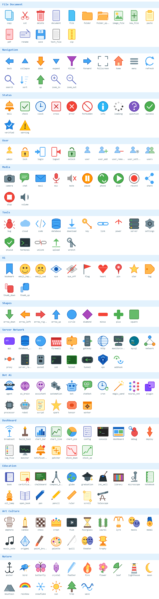

# HappyIconDLL

Windows 애플리케이션용 아이콘 리소스 DLL입니다. 200개의 아이콘을 하나의 DLL 파일에 담아 제공합니다.

## 미리보기

## 사용 방법

1. `HappyIcon.dll` 파일을 프로그램 실행 파일(.exe)과 같은 폴더에 넣습니다.
2. 프로그램에서 아이콘 리소스 ID를 지정하여 아이콘을 불러옵니다.

## 아이콘 목록

### File Document (ID 1~15)

| ID | 이름 | 설명 |
|----|------|------|
| 1 | copy | 복사 |
| 2 | cut | 잘라내기 |
| 3 | delete | 삭제 |
| 4 | document | 문서 |
| 5 | file | 파일 |
| 6 | folder | 폴더 |
| 7 | folder_open | 폴더 열기 |
| 8 | image_file | 이미지 파일 |
| 9 | new_file | 새 파일 |
| 10 | paste | 붙여넣기 |
| 11 | pdf | PDF |
| 12 | rename | 이름 변경 |
| 13 | save | 저장 |
| 14 | text_file | 텍스트 파일 |
| 15 | zip | 압축 파일 |

### Navigation (ID 16~30)

| ID | 이름 | 설명 |
|----|------|------|
| 16 | back | 뒤로 |
| 17 | collapse | 접기 |
| 18 | down | 아래 |
| 19 | expand | 펼치기 |
| 20 | filter | 필터 |
| 21 | forward | 앞으로 |
| 22 | fullscreen | 전체화면 |
| 23 | home | 홈 |
| 24 | menu | 메뉴 |
| 25 | refresh | 새로고침 |
| 26 | search | 검색 |
| 27 | sort | 정렬 |
| 28 | up | 위 |
| 29 | zoom_in | 확대 |
| 30 | zoom_out | 축소 |

### Status (ID 31~42)

| ID | 이름 | 설명 |
|----|------|------|
| 31 | bell | 알림 |
| 32 | check | 체크 |
| 33 | clock | 시계 |
| 34 | cross | X표 |
| 35 | error | 오류 |
| 36 | forbidden | 금지 |
| 37 | info | 정보 |
| 38 | loading | 로딩 |
| 39 | question | 물음표 |
| 40 | success | 성공 |
| 41 | verified | 인증됨 |
| 42 | warning | 경고 |

### User (ID 43~52)

| ID | 이름 | 설명 |
|----|------|------|
| 43 | admin | 관리자 |
| 44 | lock | 잠금 |
| 45 | login | 로그인 |
| 46 | logout | 로그아웃 |
| 47 | unlock | 잠금 해제 |
| 48 | user | 사용자 |
| 49 | user_add | 사용자 추가 |
| 50 | user_remove | 사용자 삭제 |
| 51 | user_settings | 사용자 설정 |
| 52 | users | 사용자 그룹 |

### Media (ID 53~64)

| ID | 이름 | 설명 |
|----|------|------|
| 53 | camera | 카메라 |
| 54 | chat | 채팅 |
| 55 | mail | 메일 |
| 56 | mic | 마이크 |
| 57 | mute | 음소거 |
| 58 | pause | 일시정지 |
| 59 | phone | 전화 |
| 60 | play | 재생 |
| 61 | record | 녹음/녹화 |
| 62 | share | 공유 |
| 63 | stop | 정지 |
| 64 | volume | 볼륨 |

### Tools (ID 65~79)

| ID | 이름 | 설명 |
|----|------|------|
| 65 | bug | 버그 |
| 66 | cloud | 클라우드 |
| 67 | code | 코드 |
| 68 | database | 데이터베이스 |
| 69 | download | 다운로드 |
| 70 | key | 키/열쇠 |
| 71 | link | 링크 |
| 72 | power | 전원 |
| 73 | server | 서버 |
| 74 | settings | 설정 |
| 75 | shield | 보안 |
| 76 | terminal | 터미널 |
| 77 | unlink | 링크 해제 |
| 78 | upload | 업로드 |
| 79 | wrench | 렌치/도구 |

### UI (ID 80~91)

| ID | 이름 | 설명 |
|----|------|------|
| 80 | bookmark | 북마크 |
| 81 | emoji_happy | 웃는 표정 |
| 82 | emoji_sad | 슬픈 표정 |
| 83 | eye | 보기 |
| 84 | eye_off | 숨기기 |
| 85 | flag | 깃발 |
| 86 | heart | 하트 |
| 87 | pin | 핀 |
| 88 | star | 별 |
| 89 | tag | 태그 |
| 90 | thumb_down | 싫어요 |
| 91 | thumb_up | 좋아요 |

### Shapes (ID 92~100)

| ID | 이름 | 설명 |
|----|------|------|
| 92 | arrow_down | 화살표 아래 |
| 93 | arrow_left | 화살표 왼쪽 |
| 94 | arrow_right | 화살표 오른쪽 |
| 95 | arrow_up | 화살표 위 |
| 96 | circle | 원 |
| 97 | diamond | 다이아몬드 |
| 98 | minus | 빼기 |
| 99 | plus | 더하기 |
| 100 | square | 사각형 |

### Server & Network (ID 101~118)

| ID | 이름 | 설명 |
|----|------|------|
| 101 | api | API |
| 102 | database_server | DB 서버 |
| 103 | dns | DNS |
| 104 | firewall | 방화벽 |
| 105 | ftp | FTP |
| 106 | gateway | 게이트웨이 |
| 107 | http | HTTP |
| 108 | monitoring_server | 모니터링 서버 |
| 109 | mysql | MySQL |
| 110 | network | 네트워크 |
| 111 | proxy | 프록시 |
| 112 | server_rack | 서버 랙 |
| 113 | socket | 소켓 |
| 114 | ssh | SSH |
| 115 | telnet | Telnet |
| 116 | tunnel | 터널 |
| 117 | vpn | VPN |
| 118 | webhook | Webhook |

### Bot & AI (ID 119~134)

| ID | 이름 | 설명 |
|----|------|------|
| 119 | agent | 에이전트 |
| 120 | ai_brain | AI 두뇌 |
| 121 | assistant | 어시스턴트 |
| 122 | automation | 자동화 |
| 123 | bot | 봇 |
| 124 | chatbot | 챗봇 |
| 125 | cron | 크론/스케줄 |
| 126 | magic_wand | 마법 지팡이 |
| 127 | neural_net | 신경망 |
| 128 | plugin | 플러그인 |
| 129 | processor | 프로세서 |
| 130 | robot | 로봇 |
| 131 | script | 스크립트 |
| 132 | spark | 스파크 |
| 133 | tensor | 텐서 |
| 134 | worker | 워커 |

### Dashboard (ID 135~150)

| ID | 이름 | 설명 |
|----|------|------|
| 135 | broadcast | 브로드캐스트 |
| 136 | build_tool | 빌드 도구 |
| 137 | chart_bar | 막대 차트 |
| 138 | chart_line | 선 차트 |
| 139 | chart_pie | 원형 차트 |
| 140 | config | 구성/설정 |
| 141 | console | 콘솔 |
| 142 | dashboard | 대시보드 |
| 143 | debug | 디버그 |
| 144 | deploy | 배포 |
| 145 | log_file | 로그 파일 |
| 146 | monitor | 모니터 |
| 147 | notification | 알림 |
| 148 | patcher | 패처 |
| 149 | stock_down | 주가 하락 |
| 150 | stock_up | 주가 상승 |

### Education & Knowledge (ID 151~167)

| ID | 이름 | 설명 |
|----|------|------|
| 151 | book | 책 |
| 152 | certificate | 인증서 |
| 153 | chalkboard | 칠판 |
| 154 | compass_draw | 제도용 컴퍼스 |
| 155 | globe | 지구본 |
| 156 | graduation | 졸업 |
| 157 | ink_well | 잉크병 |
| 158 | library | 도서관 |
| 159 | microscope | 현미경 |
| 160 | notebook | 노트북 |
| 161 | oil_lamp | 오일 램프 |
| 162 | open_book | 펼친 책 |
| 163 | pen | 펜 |
| 164 | pencil | 연필 |
| 165 | ruler | 자 |
| 166 | scroll | 두루마리 |
| 167 | telescope | 망원경 |

### Art & Culture (ID 168~184)

| ID | 이름 | 설명 |
|----|------|------|
| 168 | amphora | 암포라 |
| 169 | candle | 촛불 |
| 170 | chess | 체스 |
| 171 | crown | 왕관 |
| 172 | film | 필름 |
| 173 | hourglass | 모래시계 |
| 174 | laurel | 월계관 |
| 175 | lyre | 리라 |
| 176 | masks | 가면 |
| 177 | medal | 메달 |
| 178 | music_note | 음표 |
| 179 | origami | 종이접기 |
| 180 | paint_brush | 붓 |
| 181 | palette | 팔레트 |
| 182 | quill | 깃펜 |
| 183 | theater | 극장 |
| 184 | trophy | 트로피 |

### Nature & Life (ID 185~200)

| ID | 이름 | 설명 |
|----|------|------|
| 185 | anchor | 닻 |
| 186 | bird | 새 |
| 187 | butterfly | 나비 |
| 188 | crystal | 크리스탈 |
| 189 | feather | 깃털 |
| 190 | fire | 불 |
| 191 | flower | 꽃 |
| 192 | leaf | 잎 |
| 193 | lighthouse | 등대 |
| 194 | moon | 달 |
| 195 | mountain | 산 |
| 196 | rainbow | 무지개 |
| 197 | snowflake | 눈꽃 |
| 198 | sun | 태양 |
| 199 | tree | 나무 |
| 200 | wave | 파도 |

## DLL 정보

| 항목 | 내용 |
|------|------|
| 파일 | `HappyIcon.dll` |
| 아키텍처 | x86-64 |
| 아이콘 크기 | 16x16, 24x24, 32x32 (32bpp ARGB) |
| 파일 크기 | ~601 KB |
| 종류 | 리소스 전용 DLL (실행 코드 없음) |

## 라이선스

MIT License - Copyright (c) 2026 HappySloth

자유롭게 사용, 수정, 배포할 수 있습니다. 자세한 내용은 [LICENSE](LICENSE) 파일을 참조하세요.
